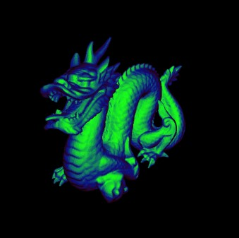
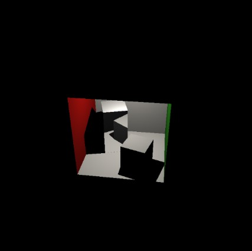
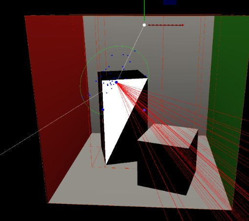
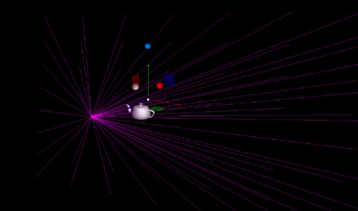
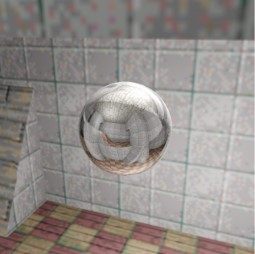
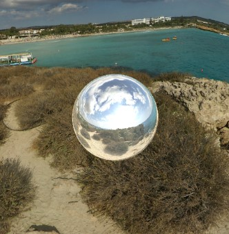
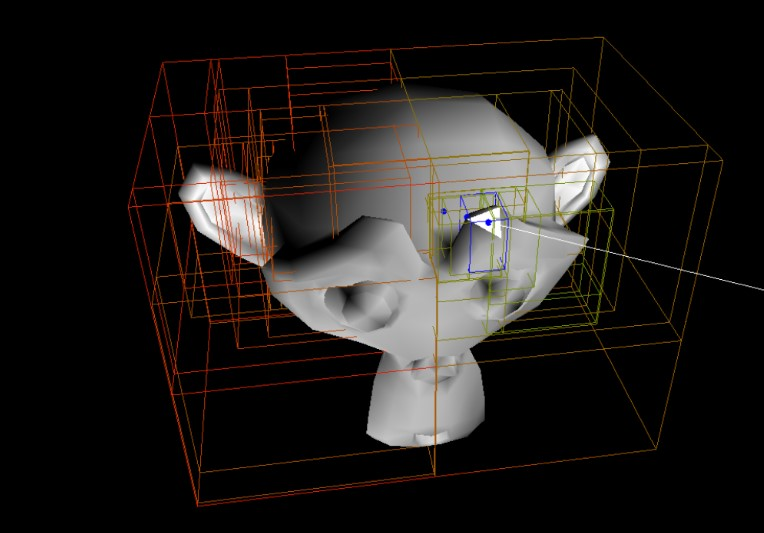

# 🎨 Advanced Ray Tracing Renderer

A high-performance ray tracer built from scratch in C++ featuring physically-based rendering, BVH acceleration, and advanced visual effects. Developed as part of the CSE2215 Computer Graphics course at TU Delft.



## ✨ Features

### Core Ray Tracing
- **Custom Ray Tracer** - Built entirely from scratch without external rendering libraries
- **BVH Acceleration Structure** - Spatial partitioning for efficient ray-scene intersection
- **Recursive Ray Tracing** - Support for reflections and refractions up to depth 6
- **Multiple Shading Models** - Phong, Blinn-Phong, and custom gradient-based shading

### Advanced Rendering

#### 🌈 Shading & Materials
- Linear gradient shading with custom color interpolation
- Phong and Blinn-Phong illumination models
- Model comparison visualization
- Diffuse, specular, and ambient lighting

#### 🪞 Reflections & Transparency
- Recursive ray reflections with proper offsetting
- Transparent materials with alpha blending
- Glossy reflections with configurable shininess
- Fresnel effects



#### 💡 Advanced Lighting
- Point lights
- Segment lights with color interpolation
- Parallelogram area lights with bilinear color sampling
- Soft shadows with multiple samples
- Shadow rays with transparency support

#### 🗺️ Environment Mapping
- Cube map environment with finite and infinite distance
- Sphere map support for alternative projections
- Adjustable cube map size (1-50 units or infinite)
- Proper UV coordinate mapping



#### ✨ Post-Processing Effects

**Bloom Filter**
- Gaussian blur with configurable kernel size
- Custom grayscale filter support
- Adjustable brightness thresholds
- Multiple threshold mapping functions (linear, square root)

**Depth of Field**
- Thin lens camera model
- Configurable aperture size and focal distance
- Realistic bokeh effects
- Multiple samples per pixel for smooth blur



### 🎯 Geometry & Acceleration

**BVH Traversal**
- Stack-based traversal algorithm
- AABB intersection testing
- Efficient triangle intersection
- Visual debugging with color-coded depth levels


**Interpolation**
- Barycentric coordinate calculation
- Normal interpolation for smooth shading
- Texture coordinate interpolation

**Texture Mapping**
- Nearest neighbor sampling
- Bilinear filtering for smooth textures
- UV coordinate support
- Visual debug mode showing texture sampling



### 🎮 Sampling & Anti-Aliasing

**Multisampling**
- Uniform pixel sampling
- Stratified (jittered) sampling for better quality
- Configurable sample count
- Visual debug showing sample distribution

## 🏗️ Technical Implementation

**Language:** C++ (94.4%)  
**Graphics:** OpenGL for visualization  
**Math:** GLM for vector/matrix operations

### Key Components
```
src/
├── shading.cpp      # Shading models and lighting
├── recursive.cpp    # Recursive ray tracing
├── bvh.cpp         # BVH acceleration structure
├── interpolate.cpp # Barycentric interpolation
├── texture.cpp     # Texture sampling
├── light.cpp       # Light sources and shadows
├── render.cpp      # Main rendering loop
└── extra.cpp       # Extra features (bloom, DoF, etc.)
```

## 🎓 Project Context

**Course:** CSE2215 - Computer Graphics  
**Institution:** TU Delft  
**Academic Year:** 2024-2025  
**Team:** Group 145

**Team Members:**
- Ksawery Radziwiłowicz (6005128)
- Mario-Alexandru Nicolae (5988543)
- Shahar Katz (5958318)

## 📊 Performance

The BVH acceleration structure provides significant performance improvements:
- Efficiently handles complex meshes (10,000+ triangles)
- Logarithmic intersection complexity
- Optimized stack-based traversal

## 📄 Documentation

Detailed implementation reports available:
- [Mandatory Features Report](report-1.pdf) - Core ray tracing functionality
- [Extra Features Report](report-2.pdf) - Advanced effects and optimizations

## 🖼️ Gallery

### Environment Mapping


### Cornell Box Reflections


---

**Note:** This is an academic project developed for educational purposes.
